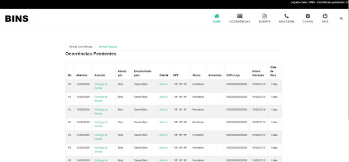

# SISTEMA DE ATENDIMENTO

Este é um prototipo de um sistema de atendimento, feito com ReactJS. Ele não possui programação, foi feito para validar a aparência e a navegação do sistema. Em outros repositórios será postado o protótipo final, já programado e integrado a uma API com NodeJS + SQL Server.

Recursos que foram utilizados:

- Axios
- Redux
- Saga
- React Navigation
- Styled Components
- ReactoTron
- ESLint
- Prettier

## Instalação

- git clone https://github.com/dbins/atendimento
- npm install
- npm install -g json-server
- Numa janela de terminal em separado, ative o backend executando o comando json-server --watch server.json --port 3004
- npm run start

A aplicação vai estar disponível no endereço [http://localhost:3000](http://localhost:3000)

Para logar, informe qualquer login ou senha. Os dados que são exibidos nas telas vem de API local que foi iniciada na janela de terminal em separado.

Se deseja ver um vídeo deste aplicativo, abra este endereço [http://www.dbins.com.br/videos/atendimento.mp4](http://www.dbins.com.br/videos/atendimento.mp4)
